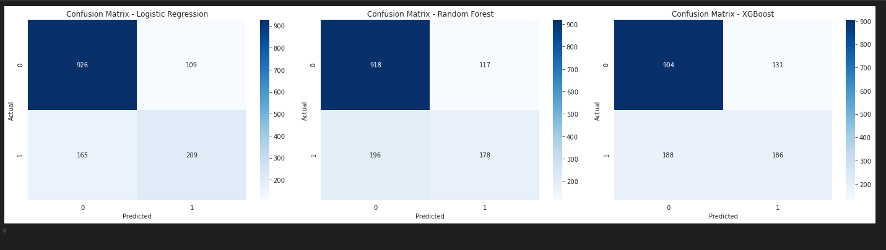
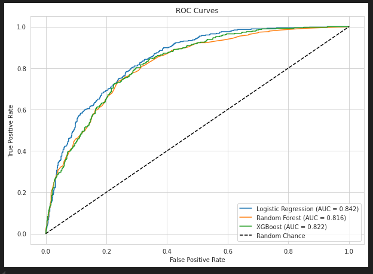
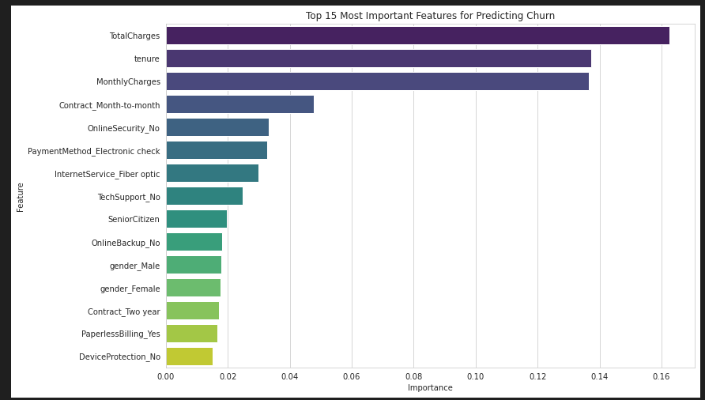
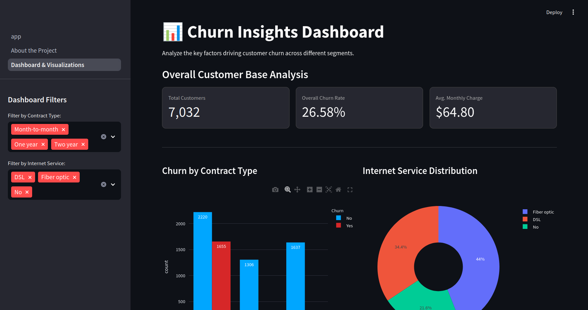

# Customer Churn Prediction System with Interactive Dashboard


---

## 1. Project Overview

This project is an end-to-end machine learning system designed to predict customer churn for a telecommunications company. The primary goal is to identify customers who are likely to cancel their subscriptions, enabling the business to take proactive retention measures.

The solution involves a complete data science workflow, from **data cleaning** and **EDA** to **model training** and **evaluation**.  
The final deliverable is a **multi-page, interactive Streamlit web application**, which allows users to:

- 🚀 Get **live churn predictions** for individual customers  
- 📊 Explore an **interactive dashboard** of historical churn data  
- 📄 Download a **professional PDF summary report** of findings  

---

## 2. Key Features of the Deployed App

- **Live Churn Predictor**: Input customer details (tenure, contract type, services, etc.) → get instant churn probability.  
- **Interactive Dashboard**: Visualization suite with filters for deep-dive analysis.  
- **Automated PDF Reporting**: One-click formal business report.  

---

## 3. Technical Walkthrough & Model Selection

### Dataset
- Source: **Telco Customer Churn dataset** (Kaggle)  
- Size: **7,043 customer records**, 21 attributes (demographics, account info, subscribed services)

### Modeling Process
Trained and evaluated three classifiers:  
- Logistic Regression (baseline)  
- Random Forest  
- XGBoost Classifier  

### Model Evaluation
- Focus: **maximize True Positives** (catch churners) while minimizing **False Negatives**.  

#### Confusion Matrices


#### ROC Curve


### Why XGBoost?
- **Best ROC-AUC (0.826)**  
- Handles complex, non-linear relationships  
- Provides **feature importance** for explainability  
- Scalable and production-ready  

---

## 4. Key Churn Drivers

From **XGBoost feature importance**:  
1. **Contract Type (Month-to-month)** → highest predictor of churn  
2. **Tenure** → low tenure = higher churn  
3. **Internet Service (Fiber Optic)** → higher churn risk  
4. **Total Charges** → lower spending customers churn more  



---

## 5. The Interactive Dashboard Explained

The app has **3 pages**:

### 🏠 Churn Predictor (Home)
- Sidebar form → user inputs customer details  
- Outputs: churn probability %, risk level, and recommended business action  

### 📊 Dashboard & Visualizations
- Interactive filters (e.g., Contract Type, Internet Service)  
- KPIs (Total Customers, Churn Rate)  
- Charts update dynamically  
- **Radar chart** comparing individual predictions to average loyal vs churned customers 

 

### 📄 About the Project
- Explains the **business problem**, dataset, methodology, and tools  

---

## 6. Project Structure

    ├── .streamlit/
    │ └── style.css # Custom CSS for the app
    ├── app.py # Main Streamlit app (Predictor)
    ├── pages/
    │ ├── 1_📊_Dashboard_&Visualizations.py
    │ └── 2_📄_About_the_Project.py
    ├── generate_report.py # PDF report generator
    ├── data/
    │ ├── raw/WA_Fn-UseC-Telco-Customer-Churn.csv
    │ └── processed/
    ├── models/
    │ └── churn_predictor.joblib # Pre-trained model pipeline
    ├── notebooks/
    │ └── 01_churn_prediction_model.ipynb # EDA & training notebook
    ├── reports/
    │ └── feature_importance.png # Saved plots for reports
    └── requirements.txt # Python dependencies


---

## 7. How to Run Locally

### Prerequisites
- Python 3.8+  
- Conda (recommended)  

### Steps

```bash
# Clone repo
git clone https://github.com/mutembeic/FUTURE_ML_02.git
cd  FUTURE_ML_02

# Create environment
conda create --name churn_env python=3.8
conda activate churn_env

# Install dependencies
pip install -r requirements.txt
```

If churn_predictor.joblib is missing, run the notebook first:
    ``` jupyter notebook notebooks/01_churn_prediction_model.ipynb```

Then launch the app:
    ```streamlit run app.py```

8. ### Actionable Business Recommendations

✅ Convert month-to-month customers into long-term contracts with discounts/upgrades

✅ Improve first 90 days onboarding with support & check-ins

✅ Investigate fiber optic service issues (pricing, reliability, support)

✅ Promote sticky bundles (OnlineSecurity, TechSupport)

